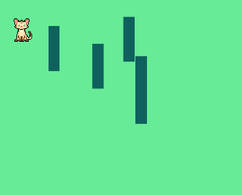

# 2D Browser Game

A coding tutorial created to review and practice basic JavaScript by creating a question and answer game. Completed through Mammoth Interactive at [link to Mammoth Interactive Homepage](https://training.mammothinteractive.com/courses).

## Tech Used
- JavaScript
- HTML
- CSS

## How to play
Use the w, a, s and d keys to move the character on the screen. To stop the character from moving, simply let up on the key being pressed.
- w moves character up
- s moves character down

## Dependencies
None. Viewer only needs to utilize Live Server through the index.html file.

## Uses
A basic 2D game allowed me to better understand the language of JavaScript. We used HTML canvas, which I had never heard of or used. I spent a good amount of time looking for character images and stumbled across a lot of resources that I need to look into further.

## How I veered from the original project
- used a local file of an image, in assets/images instead of an external link

## History
After completing a Software Engineering certification program and during my job search, I needed to continue to pracitce my skill set in order to maintain it and learn more. I thought that even the most basic projects using the most basic languages was a great place to start.

## Screenshot 1

## Screenshot 2

